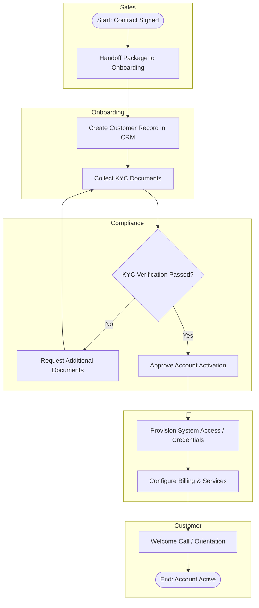

# Customer Onboarding Process

## Business Objective
Move a new customer from signed agreement to fully active account with accurate records, correct system access, and a positive first-touch experience, while satisfying KYC/compliance checks.

## Swimlanes (Roles)
- Sales
- Onboarding Specialist
- Compliance / KYC
- IT / Systems
- Customer

## BPMN-Style Flow

## Key Decision Points
- KYC verification gateway ensures no account is activated without passing compliance checks.
- Escalation path exists for incomplete documentation, looping back to the customer without restarting the whole process.

## Exception Handling
- Failed KYC checks trigger a document request loop rather than process termination.
- Provisioning failures are logged and routed to IT support queue for same-day resolution.

## KPIs Tracked
- Time-to-activate (contract signature to active account)
- KYC first-pass approval rate
- Onboarding satisfaction score (post welcome call survey)

## Improvement Opportunities Identified
- Pre-populate KYC forms using data already captured during the sales stage to reduce customer effort.
- Parallelize IT provisioning with compliance review where policy allows, instead of running them sequentially.
