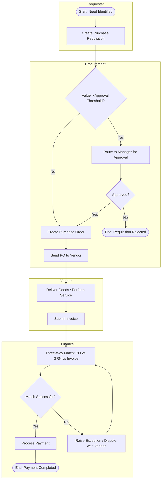

# Procure-to-Pay (P2P) Process

## Business Objective
Standardize how the organization requests, approves, receives, and pays for goods and services, ensuring budget compliance, vendor accountability, and audit-ready financial records.

## Swimlanes (Roles)
- Requester (Business Unit)
- Procurement Team
- Approving Manager
- Vendor
- Finance / Accounts Payable

## BPMN-Style Flow

## Key Decision Points
- Approval threshold check determines whether manager sign-off is required before a purchase order is issued.
- Three-way match (purchase order, goods receipt note, invoice) gates payment release and catches discrepancies early.

## Exception Handling
- Rejected requisitions are returned to the requester with reason codes.
- Invoice mismatches trigger a dispute sub-process with the vendor before payment is reprocessed.

## KPIs Tracked
- Requisition-to-PO cycle time
- Invoice match rate (first-pass yield)
- Days payable outstanding (DPO)

## Improvement Opportunities Identified
- Introduce auto-approval for low-value, pre-approved vendor categories to reduce cycle time.
- Automate three-way matching using OCR-based invoice capture to reduce manual exceptions.
