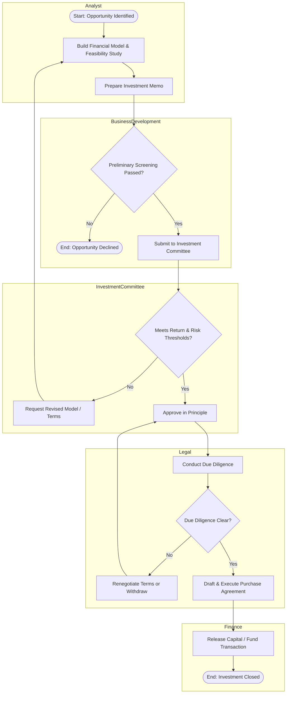

# Real Estate Investment Approval Process

## Business Objective
Ensure every property acquisition or development investment is evaluated against financial return thresholds, risk criteria, and market feasibility before capital is committed, with clear accountability at each approval gate.

## Swimlanes (Roles)
- Investment Analyst
- Business Development
- Investment Committee
- Legal
- Finance

## BPMN-Style Flow

## Key Decision Points
- Preliminary screening filters out opportunities that do not meet basic strategic fit before committee time is spent.
- Investment Committee gate evaluates IRR, payback period, and risk rating against the firm's investment policy.
- Due diligence gate can send terms back for renegotiation rather than an automatic walk-away.

## Exception Handling
- Failed committee review routes back to the analyst with specific revision requests rather than closing the opportunity outright.
- Due diligence issues (title, zoning, environmental) trigger a renegotiation loop before deal withdrawal is considered.

## KPIs Tracked
- Time from opportunity identification to committee decision
- Percentage of approved deals that close successfully
- Variance between modeled and actual IRR post-close

## Improvement Opportunities Identified
- Standardize the investment memo template to cut analyst preparation time.
- Run legal due diligence in parallel with committee review for lower-risk deal categories to compress the overall cycle time.
